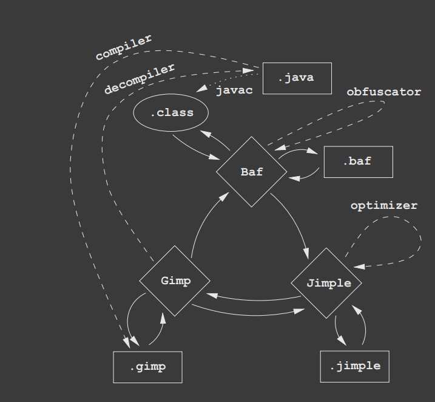

# Android APK Hierarchy

Android Application Package (APK) is essentially a zip file with a different extension. The parts of an APK include:

- `META-INF/`: 资源列表，认证，manifest
- `res/`: contains resources not compiled into resources.arsc (such as UI layouts and strings).
- `AndroidManifest.xml`: manifest file which describes the fundamental characteristics of the app and defines each of its components.
- `classes.dex`: contains the compiled source code to be run on the device.
- `resources.arsc`: containing precompiled resources, such as binary XML for example.
- `assets/`: This directory contains applications assets, which can be retrieved by AssetManager.
- `lib/`: .so

# Smali
基本类型
```
byte - 1 byte -- B
char - 2 bytes -- C
short - 2 bytes -- S
long - 8 bytes -- J
boolean - 1 byte -- Z
array - xxx -- [B / [I / [Ljava/lang/String;
```

方法

`method_name(param_type1param_type2 ...) return_type`

```
Hello(Z[I[ILjava/lang/String;)Ljava/lang/String;

String Hello(boolean, int[], int[], String)
```

关键词
```
.locals #registers
.prologue #begin of method
.field static final
.method public static
.param p0, "context"    # Landroid/content/Context;
.line 12
const/4 v0, 0x0
```


# AST, CFG, BNF
- `AST` (Abstract Syntax Tree) 抽象语法树
- `CFG` (Control Flow Graph) 控制流图
- `BNF` (Backus-Naur Form) 巴科斯范式


### Jimple
Java bytecode 的一种中间表示，在 Soot 框架中用来简化分析，以及简化向 java 字节码的过渡。

```Java
public class Lab1 extends java.lang.Object
{

    public void <init>()
    {
        Lab1 r0;

        r0 := @this: Lab1;

        specialinvoke r0.<java.lang.Object: void <init>()>();

        return;
    }
    ...
```
https://www.jianshu.com/p/f6a0973e12fd

JVM 里四种主要方法调用：
- specialinvoke：用于调用构造方法、父类方法、私有方法
- virtualinvoke：用于调用普通的成员方法，进行virtual dispatch
- interfaceinvoke：用于调用继承的接口的方法，不能做优化，需要检查是否实现了接口中的方法
- staticinvoke：用于调用静态方法
  
