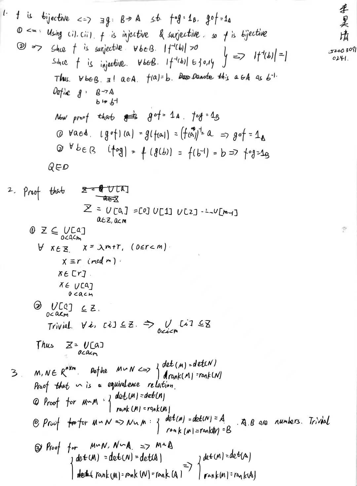

# Homework 1

## 3. Let A, B be two finite sets with |A|= |B|. Show that a map f : A →B is injective ⇐⇒f is surjective.
### Solution:
$\Rightarrow$:

Let $f$ be injective. Then $f(a_1) = f(a_2) \Rightarrow a_1 = a_2, \forall a_1, a_2\in A$. 

Which implies $|\operatorname{Im} f| = |A|$, and that $|\operatorname{Im} f| = |B|$. Since $\operatorname{Im} f \subset B$, we have $\operatorname{Im} f = B$. $f$ is surjective.

$\Leftarrow$:

Let $f$ be surjective. Then $|\operatorname{Im} f| = |B|$. Since $|A| = |B|$, $\operatorname{Im} f = |A|$.  Thus $f$ is injective, otherwise we should have $|\operatorname{Im} f| < |A|$.

## 4. Let A be a set. Denote by Σ(A) the set of all bijections from A to A. The binary operation $\circ$ is composition of maps: $f\circ g: A \mapsto A$. Show that $(\Sigma(A), \circ)$ is a group.

### Solution:
1. Obviously, $\circ$ is closure on $\Sigma(A)$ and is associative. So $\Sigma(A)$ is a semi-group.
2. The identity element is the identity map $I_A: A\mapsto A$, since $f\circ I_A = I_A\circ f = f$. $\Sigma(A)$ is a monoid.
3. For each $f\in \Sigma(A)$, since $f$ is a bijection, $\exists f^{-1}$, such that $f\circ f^{-1} = f^{-1}\circ f = I_A$. $\Sigma(A)$ is a group.

## 5. Consider the set of maps from R to R given by $x →ax+b$, where $a ∈R^∗, b ∈R$. Show that this is a group under composition ◦.

### Solution:
Denote the set as $G$.

1. Oblviously linear composition is still a linear map, so $G$ is closed under composition. 
2. Composition is associative. So $G$ is a semi-group.
3. Let $a = 1, b = 0$, then $I_R\in G$. So $G$ is a monoid.
4. $\forall f(x) = ax+ b \in G$, solve the equation $a(cx+d) + b = x$, we have $ac = 1, ad + b = 0$. So we could guess $f^{-1}(x) = \frac{1}{a} x - \frac{b}{a}$. 
   
   Verification: $f^{-1}\circ f(x) = \frac{1}{a} (ax+b) - \frac{b}{a} = x$. So $f^{-1}$ is the inverse of $f$. 
   
$G$ is a group.

## 6. Let $G = Q\backslash \{−1\}$. The binary operation ∗ is defined as $a ∗b = a + b + ab$. Show that (G, ∗) is a group. When $G = Z\backslash\{−1\}$, is (G, ∗) still a group?

### Solution:
1. Closure: $a*b = a + b + ab = (a+1)(b+1) -1$. Since $ a\neq -1, b\neq -1$, $(a+1)(b+1) \neq 0, a*b \neq -1$. So $a*b \in G$.
2. Associativity: $a*(b*c) = a*(b+c+bc) = a + b + c + bc + a(b+c + bc) = a+ b + c + ab + ac + bc + abc = (a+b+ab) + c + c(a+b+ab) = (a*b)*c$.
3. Identity: $e = 0\in G$. $a*e = a + 0 + 0 = a$. $e*a = 0 + a + 0 = a$.
4. Inverse: Solve for $a *b =0$, $a+ b + ab = 0$, $b = -\frac{a}{a+1}$.
   
   Let $a^{-1} \triangleq -\frac{a}{a+1}$. 
   - $a*a^{-1} = a + (-\frac{a}{a+1}) + a(-\frac{a}{a+1}) = \frac{a^2}{a+1} - \frac{a^2}{a+1} =0$.
   - $a^{-1}*a = a*a{-1} = 0$

So $(G, *)$ is a group.

When $G = Z\backslash\{−1\}$, $(G, *)$ is not a group. Since it is impossible to find an inverse for $1$

## 7. Let G be a nonempty finite set with associative binary operation such that $\forall a, b, c ∈G, ab = ac \Longrightarrow b = c$ and $ba = ca \Longrightarrow b = c$. Then G is a group. Show that this conclusion may be false if G is infinite.

### Solution:
Just prove the existence of identity and inverse.

1. Identity: Arbitrarily pick an element $a\in G$. Consider the set $S = \{a, a^2, a^3, \ldots\}$. 
   
   Since $|G| <\infty$, $\exists n > 1, a^n = a$. We claim that $e = a^{n-1}$

   Now prove that $\forall b\in G, eb = be = b$. 

   $aeb = a a^{n-1} b = a^nb = ab$, cancel $a$ on both sides, we have $eb = b$. Similarly, $be = b$.

2. Inverse: $\forall b \in G$, treat $b$ as the $a$ above. $\exists m > 1, b^m = b$. We claim that $b^{m-2}$ is the inverse of $b$. For $m=2$, $b=e$.

   The proof is simple, $b^{m-1} = e = b b^{m-2} = b^{m-2}b$.

Thus the finite $G$ is a group.

When $G$ is infinite, the claim that $\exists n > 1, a^n = a$ may not hold. For example, $Z$ under multiplication satisfies cancellation law, but it is not a group.

## 8. If G is a group, a, b ∈G and $bab^{−1} = a^r$ for some r ∈N, then $b^j ab^{−j} = a^{r^j}$ for all j ∈N.

### Solution:
$$
bab^{-1} = a^r \Rightarrow ba = a^rb
$$
$$
\begin{align*}
    b^j ab^{-j} &= b^{j-1}(ba)b^{-j} \\
    &= b^{j-1}a^rb^{-j +1}\\
    &= b^{j-2}b a^{r}b^{-j+1}\\
    &= b^{j-2}a^r b a^{r-1}b^{-j+1}\\
    &= b^{j-2} a^{r^2} b^{-j+2}\\
    &= \cdots\\
    &= b^{j-k} a^{r^k} b^{-j+k}\\
    &= a^{r^j}
\end{align*}
$$

## 9. For a, b ∈G, show that a is the inverse of $b \Longleftrightarrow$ $aba = a$ and $ab^2a = 1$.

### Solution:
$\Rightarrow$:Trivial.

$\Leftarrow$: 
- $aba = a \Rightarrow ba = 1, ab = 1$. 
- $ab^2a = 1 \Rightarrow b^2 = a^{-2}$. I don't know how to prove $b = a^{-1}$ from this.

## 10. If $a^2 = 1$ for all a ∈G, show that G is abelian.

### Solution:
$$
\begin{align*}
    ab &= (ab)^{-1}\\
    &= b^{-1}a^{-1}\\
    &= ba
\end{align*}
$$

## 11. Let $f, g : R^2 →R^2$ and $f (x, y) = (−x, y), g(x, y) = (−y, x)$. Define $G = \{f^ig^j |i = 0, 1; j = 0, 1, 2, 3\}$. Show that G is a group under composition ◦. Is this group abelian? (Hint: Try to find a formula for $(f^ig^j ) ◦(f^sg^t) = f^ag^b$ that expresses a, b in the terms of i, j, s and t)

### Solution:
<!-- Let $T(x,y) = (y,x)$, then $g(x,y) = f \circ T$. And we have $T \circ f = (y,-x) = - f\circ T$

So $g^j = (f\circ T)^j = (f\circ T)^{j-2} \circ f \circ T\circ f\circ T = - (f \circ T)^{j-2}f^2 = -(f\circ T)^{j-2}= - g^{j-2}$.
$$
g^j = (-1)^{j//2} g^{j\%2} = (-1)^{j//2} (f\circ T)^{j\%2}
$$
$$
f^i g^j = (-1)^{j//2} f^{i\% 2} (f\circ T)^{j\%2} = (-1)^{j//2} f^{(i+j)\%2} T^{j\%2}   
$$
$$
f^i g^j \circ f^s g^t = (-1)^{j//2} f^{i+j\%2} T^{j\%2} (-1)^{t//2} f^{s+t\%2} T^{t\%2} = (-1)^{j//2 + t//2} f^{(i+s+j+t)\%2} T^{(j+t)\%2}
$$

Thus
- Closure: $f^i g^j \circ f^s g^t \in G$, since $f^i g^j = (-1)^{j//2} f^{(i+j)\%2} T^{j\%2}$ contains all combination of $\pm, f, T$.
- Associativity: Trivial.
- Identity: $f^0 g^0 = I_{R^2}$
- Inverse: $\forall f^ig^j \in G$, $f^ig^j = (-1)^{j//2} f^{(i+j)\%2} T^{j\%2}$, so it has a inverse $(-1)^{j//2}f^{(i+j)\%2} T^{j\%2}$. -->
Observation:
$$
\begin{gather*}
f^2 = I, g^2 = -I\\
f\circ g = (y,x) = -g\circ f
\end{gather*}
$$
$$
f^i g^j \circ f^s g^t = (-1)^{ts}f^i g^j \circ (g^t f^s) = (-1)^{ts} f^i g^{j+t} f^s = (-1)^{ts + s(j+t)} f^{i+s} g^{j+t} = (-1)^{sj}f^{i+s} g^{j+t}
$$

Thus
- Closure: $f^i g^j \circ f^s g^t \in G$, since $f^{i+j}g^{j+t} \in G$, and $(-1)^{sj}f^{i+s} g^{j+t}$ is either the positive or negetive expression of it.
- Associativity: Trivial.
- Identity: $f^0 g^0 = I_{R^2}$
- Inverse: 
  
  List all the elements in $G$:
    $$
    \begin{align*}
        f^0 g^0 &= I, (f^0 g^0)^{-1} = f^0g^0\\
        f^0 g^1 &= g, (f^0 g^0)^{-1} = g^3\\
        f^0 g^2 &= -I, (f^0 g^2)^{-1} = g^2\\
        f^0 g^3 &= -g, (f^0g^3)^{-1} = g\\
        f^1 g^0 &= f, (f^1g^0)^{-1} = f\\
        f^1 g^1 &= T, (f^1g^1)^{-1} = fg\\
        f^1 g^2 &= -f, (f^1g^2)^{-1} = fg^2\\
        f^1 g^3 &= -T, (f^1g^3)^{-1} = fg^3\\
    \end{align*}
    $$
    
    So $\forall f^ig^j \in G$, it has a inverse.

The group is not abelian, since $f^ig^j\circ f^sg^t = (-1)^{sj}f^{i+s} g^{j+t} \neq (-1)^{it}f^{i+s} g^{j+t} = f^sg^t\circ f^ig^j$ when $i\neq s$.