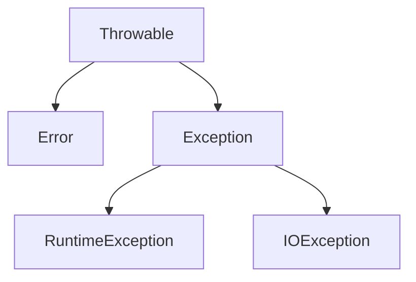
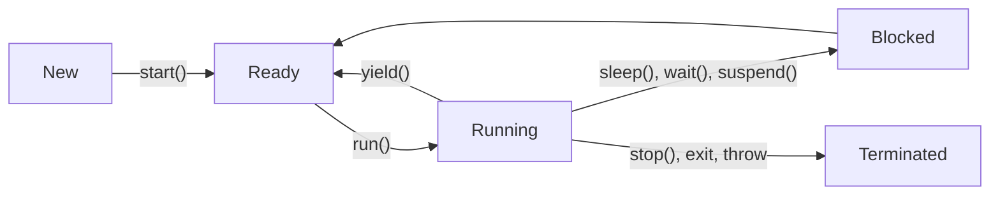

# Java 历史
- Java SE (Desktop dev, GUI, 不常用了)
- Java EE (server backend)
- Java ME (mobile)

> JDK = dev tools & api + JRE
>
> JRE = Java API + (Deployment) = JVM + libs

不同 JVM 实现 (Hotspot, Oracle, Taobao) 有不一样的 feature，但都实现了 java api

# 内存布局
#### JVM 栈
局部变量、栈帧、dll?

#### Java 堆
new 出来的实例，（似乎类似 c 的 layout），所有 class 都是 new 出来的

#### 方法区
用于存储类信息、常量、静态变量、即时编译器编译后的代码等数据。在 JDK 8 及之前，方法区在 HotSpot 虚拟机中称为永久代（Permanent Generation），在 JDK 8 后被元空间（Metaspace）取代。
- 运行时常量池：方法区的一部分，用于存放编译期生成的各种字面量和符号引用。


#### 程序计数器

#### 本地方法栈


# Project Hierarchy
```
project
├── module
└── module
    └── package
        (subpackage)
        └── .java
```

- 包名小写，域名倒置，与文件夹一致
- \* 通配符不会匹配子目录
- import static 可以直接调用静态方法

#### 权限
- private: 本类内
- 缺省: 本包内
- protected: 本包内 + 其他包的子类
- public: 全部

# 数据类型
分为基本数据类型和引用类型，引用类型如
- class, [], interface, enum, record, annotation
- 引用类型是隐式的指针，类似 python 的 mutable

> Scanner, Math

#### 初始化
`int[3][]` 初始化为 `null`，`int[3][3]` 初始化为 `0`，`String[3]` 初始化为 `null`

类的 field 有默认初始化值（会先于 \<init> 赋值一次），局部变量没有


#### 可变参数
```java
void method(int... a) { // the same as int[] a
    for (int i : a) {
        System.out.println(i);
    }
}
```
用 new 传参效果一样，但这样支持省去 new

#### Object
所有类都是 Object 的子类，Object 的方法
- clone, equals, toString, hashCode
- getClass
- notify, notifyAll, wait
- finalize

> default toString: `getClass().getName() + "@" + Integer.toHexString(hashCode())`

# 类 class
一个文件只能有一个 public class，实际执行的是 .class 文件对应类名

#### 代码块
- static 代码块在类加载时执行
- 非 static 代码块在实例化时执行。时机早于构造函数，和 definition 同优先级，并且都会被放到 \<init> 中

#### 内部类
> example
>
> Thread::State, HashMap::Node

可以使用 private, static, final 修饰，可以继承

成员内部类
- 声明在类内部
- static 修饰：`Outer.Inner inner = new Outer.Inner()`
- 不用 static 修饰：`Outer.Inner inner = outer.new Inner()`

局部内部类
- 声明在方法、代码块内
- 匿名
- 非匿名

> ```java
> public Comparable getComparable() {
>     class MyComparable implements Comparable {
>         @Override
>         public int compareTo(Object o) {
>             return 0;
>         }
>     }
>     return new MyComparable();
> }
> 
> public Comparable getComparable() {
>     return new Comparable() {
>         @Override
>         public int compareTo(Object o) {
>             return 0;
>         }
>     };
> }
> ```


编译得到的结果用 `$` 表示分隔

#### static field/method
- static field 在 jdk 8 之前在方法区，之后在堆
- static method 只能访问 static field/method

#### final
- final field = const
- final method 不能被 override
- final class 不能被继承

### \<init>
\<init> 包括
- field 的 definition 初始化
- 代码块
- 构造函数

> 类的 field 有默认初始化值（会先于 \<init> 赋值一次），局部变量没有

> 用 `this()` 调用构造函数

### 继承 extends
仅可以单继承，不能 override private 方法

#### 多态
```java
A a = new B();
a.method(); // B.method()
```

即所有函数都是 virtual

#### 抽象类，抽象方法 abstract
抽象类不能被实例化，有抽象方法的类必须是抽象类

### 匿名实现类
```java
A a = new A() {
    public void someMethod {
        System.out.println("a");
    }
};
```

### 接口
- public static final
- public abstract


#### 支持多继承
支持同时实现多个接口，支持实现接口的同时继承一个类，继承类的方法优先级高于接口
```java
class A extends B implements C, D 
```

同名函数需要 override，可以用 `super` 调用父类方法


### Enum 枚举类
Java 5.0 之前的定义用 class
```java
class Season {
    private final String name;
    private final String desc;

    public static final Season SPRING = new Season("spring", "warm");
    public static final Season SUMMER = new Season("summer", "hot");
    public static final Season AUTUMN = new Season("autumn", "cool");
    public static final Season WINTER = new Season("winter", "cold");
    
    private Season(String name, String desc) {
        this.name = name;
        this.desc = desc;
    }
}
```

Jdk 5.0 之后用 enum
```java
class Season{
    // public static final 默认有了
    SPRING("spring", "warm"),
    SUMMER("summer", "hot"),
    AUTUMN("autumn", "cool"),
    WINTER("winter", "cold");

    // Supports custom field type
    private final String name;
    private final String desc;

    private Season(String name, String desc) {
        this.name = name;
        this.desc = desc;
    }
}

```

不同于 C++，Java 的 enum 可以自定义 field 和 method。C++ 哪怕是 `enum class` 也不能有 field 和 method

枚举类自动继承了 `java.lang.Enum` 类，不能再继承其他类，可以实现接口。Enum 直接继承 Object

#### 常用函数 method
```java
Spring.toString(); // SPRING
Spring.name(); // SPRING
Season[] seasons = Season.values(); // array of enum
Season spring = Season.valueOf("SPRING"); // exception
Season.SPRING.ordinal(); // 0
```

#### 匿名实现接口
接口既可以按传统 class extend 的方式实现，也可以用匿名实现每个枚举变量
```java
enum Season implements Info {
    SPRING("spring", "warm"){
        public void show() {
            System.out.println("spring");
        }
    },
```

## Annotation 注解
Java 5 后，引入了 `@Override`, `@Deprecated`, `@SuppressWarnings` 等，可以在类编译、运行时加载，体现不同的功能
- 可用于修饰包、类、构造函数、方法、成员变量、参数、局部变量声明
- 可以添加 k-v 参数 `@SuppressWarnings(value = "unchecked")`

#### 注释中的注解

#### @override
编译器检查 method 方法是否真的重写了父类方

#### @deprecated, @SuppressWarnings
可以控制 unused

#### 网络框架

框架 = 注解 + 反射回调 + 设计模式

### 单元测试
JUnit，使用 @Test

JUnit 里写了主函数，调用 custom 测试类的实例。要求
- 仅 1 个无参构造函数
- method 无参，void，public


## 包装类
基本类型不继承 Object，且不是引用类型，对于多数接口无法使用
- `func(Object input)`
- `func<T>` Java 的泛型要求引用类型

于是用包装类包装基本数据类型，

| Basic Type | Wrapper Class |
| ---------- | ------------- |
| boolean    | Boolean       |
| byte       | Byte          |
| int        | Integer       |
| char       | Character     |

- Wrapper 的初值是 null
- 显式装箱：`Integer.valueOf(123)`，拆箱：`i.intValue()`
- 自动装箱：`Integer i = 123`，拆箱：`int j = i` (above jdk 5.0)
- 和 String 互转：`Integer.parseInt("123")`, `i.toString()`, `String.valueOf(i)`

> Boolean 从 string 的初始化是 'true'.equalsIgnoreCase(inStr)

#### 常量池
\- 128 ~ 127 的 Integer 已预先创建保存在 cache 数组里，超出范围才会 new，`Integer.valueOf(127) == Integer.valueOf(127)` 为 true

除了 double 和 float，其他基本类型都有常量池，-128 ~ 127 或 0 ~ 127

基本类型和包装类比较时，会自动拆箱


# 异常 Exception, Error
Error 一般指 JVM 无法处理的错误，如内存溢出，栈溢出，线程死锁等

Exception 分为 checked 和 unchecked（受检异常）
- checked 是编译时异常. eg, class not found, file not found, io exception
- unchecked 是运行时异常

#### try, catch, finally
java 函数需要显式声明可能抛出的异常（非 RuntimeException），否则编译不通过
```java
public void method() throws IOException {
    throw new IOException();
}
```

finally 一定会执行，除非 System.exit，哪怕 catch 里有 return
```java
public int method(int num = 10){
    try {
        return num; // return here, return 10(stack val), but num is 11(local variable)
    } catch (Exception e) {
        return 0;
    } finally {
        num++; // finally 被插入在 push 和 ret 之间
    }
}
```

#### 异常对象的继承关系

每个异常类有一个 static final long serialVersionUID，用于序列化，唯一标识一个异常类


# 并发编程
Java 提供了两种方法创建线程，支持起名字
1. 继承 Thread 类，重写 run，生成对象并 start
2. 实现 Runnable 接口，实现 run 方法，将实现类的对象传入 Thread 构造函数（设计模式：代理模式, Thread : Runnable）

其中，Thread.start() 会调用 native 的 start0 方法，getcurrenthread 会调用 native 的 currentThread 方法


#### Callable
jdk 5.0 之后的新接口，类似 Runnable，但是可以有返回值，可以抛出异常

```java
public interface Callable<V> {
    V call() throws Exception;
}

// FutureTask -> RunnableFuture -> Runnable, Future
FutureTask<Integer> task = new FutureTask<>(new Callable<Integer>() {
    @Override
    public Integer call() throws Exception {
        return 100;
    }
});
new Thread(task).start();
```

#### 线程池
减小创建和销毁线程的开销，提高响应速度

> HTML 解析 img 的时候可能会每个 img 开一个线程，于是早期安卓会出现划一下屏幕死机，因为创建了太多线程


```java
ExecutorService service = Executors.newFixedThreadPool(10);
service.execute(new Runnable() {
    @Override
    public void run() {
        System.out.println("thread name: " + Thread.currentThread().getName());
    }
});
service.shutdown();
```

### 常用方法
#### yield
让出 cpu，但不一定成功

#### join, isAlive

#### 优先级 setPriority, getPriority
```java
Thread.MAX_PRIORITY = 10,
Thread.MIN_PRIORITY = 1,
Thread.NORM_PRIORITY = 5
```
仍然是多线程，按比例的

### 线程的生命周期
JDK 1.5 之前 

JDK 1.5 之后，Ready, Running 被合称为 Runnable. 阻塞被细分为 TIMED_WAITING, WAITING, BLOCKED。去网上找示意图吧不好画

## 线程同步
### 同步代码块
相当于 #pragma omp critical
```java
synchronized (同步监视器) { // this, Derived.class
    // 需要同步的代码
}
```
其中，同步监视器可以是任何对象，但是推荐使用共享资源作为监视器。哪个线程获得了监视器，哪个线程就执行代码块，其他线程等待（锁）

### 同步方法
```java
public synchronized void method() {
    // 需要同步的代码
}
```
注，非静态方法的同步监视器是 this，需要保证 this 是唯一的。静态方法的同步监视器是 class

#### Volatile
解决指令重排 (?)

## JUC Java.util.concurrent
### Lock
Lock 本身是一个接口，实现类有 ReentrantLock 等

```java
Lock lock = new ReentrantLock();
lock.lock();
try {
    // 需要同步的代码
} finally {
    lock.unlock();
}
```

## 线程通信
### 
在 synchronized scope 下，可以使用 wait, notify, notifyAll 来实现线程通信（Object）

- wait 不同于 sleep，会释放同步监视器
- notify 唤醒一个优先级最高的线程，同优先级随机。（不一定能拿到同步监视器）；notifyAll 唤醒所有线程
- 必须在同步代码块或同步方法中使用，调用这些函数的 instance 必须是同步监视器，如 `this.wait()`

> Lock 配合 Condition 实现线程通信


# 常用类
## String
```java
public final class String implements Serializable, Comparable<String>, CharSequence
```

字符串常量都存储在字符串常量池中，新变量可以不用 New。
- 在 1.7 之后，常量池从方法区换到了堆（GC 频率高）

#### 内部数据类型
- JDK 9 之前是 char[], 2 byte/char(UTF8)
- JDK 9 之后做了优化，对于 Latin-1 改成 byte[]

字符串是不可变的，`+=` 会在常量池外生成一个新的对象并引用
- `intern()` 返回常量池中该字符串

字符串常量池里也是 wrapper，指向实际 .data

#### String 拼接 + 
- 两个常量拼接直接优化
- 其他情况用 StringBuilder

#### StringBuffer, StringBuilder
都表示可变的字符序列，他们继承于相同的父类 `AbstractStringBuilder`。

- StringBuffer 线程安全(synchronized)，效率略低于 builder
- 类似 STL，底层和 String 一样是 char[]/byte[]
- 扩容策略 max(2capacity + 2, newCapacity)
- 初始额外预留 16 个字符

## 日期时间 api
#### Date, Calender
JDK 8 之前的类，不推荐使用.
- 有偏移，年份从 1900 开始，月份从 0 开始
- 无法处理闰秒

#### java.time
> 在 jdk 8 的时候，很多程序员不再使用 Date, Calender，而是使用了第三方 joda-time

JDK 8 之后的类，抄的 joda-time。
- localDate, localTime, localDateTime, of
- Instant 时间戳，距 1970-01-01T00:00:00Z 的秒数
- DateTimeFormatter

## 比较器
排序时会用

#### Comparable
通过实现 Comparable 接口的 compareTo 接口

#### Comparator
更灵活，适用于不适合 Comparable 的情况。可以覆盖对象 Comparable 的方法

```java
public class Comparator implements java.util.Comparator<T> {
    public int compare(T o1, T o2) {
        return 0;
    }
}
```

## System
```java
gc();
getProperty("java.version"); // version, JavaHome, cwd
arraycopy(src, srcPos, dest, destPos, length);

// in, out, err

// Java Runtime
java.lang.Runtime 
```

## Math
BigDecimal, BigInteger

## 数据结构，集合框架
最基础的是 Collection, Map 接口，List, Set 等子接口

#### Collection
子接口
- List: 有序可重复. 
  - `ArrayList`（主要实现类，线程不安全，可以用 Collections 的工具类裹一层）
  - `LinkedList`（双向链表，适合频繁插入删除）
  - `Vector`(almost deprecated)
- Set：无序不可重复. `HashSet`, `LinkedHashSet`, `TreeSet`
  - HashSet 底层使用 HashMap, 即 数组 + 单向链表 + 红黑树
  - LinkedHashSet 是 HashSet 的子类，在 数组 + 单向链表 + 红黑树 的基础上，增加了双向链表，用于记录元素的添加顺序。支持按添加元素顺序遍历  
  - 添加到 (Linked)HashSet 的元素需要重写 equals 和 hashCode，并且应当自洽。如 `ret = 31ret + <nextField>.hashCode()`
  
+ TreeSet 底层是红黑树，可以按照添加对象的指定属性进行排序
  + 不用 equals, 用 compareTo, compare


#### Map
与 Collection 同级的接口，存储 pair-wize 数据。`HashMap`, `LinkedHashMap`, `TreeMap`, `Hashtable`, `Properties`
- HashMap（主要实现类，线程不安全，支持 null）
  - 数组 + 单向链表 + 红黑树(jdk8)
- LinkedHashMap : HashMap 是 HashMap 的子类，底层增加了一个 双向列表记录添加顺序，提高遍历效率
  - 内部 Entry 类
    - key, value, next
- TreeMap 用 key 做红黑树


- Hashtable（jdk 1.0, deprecated）
  - 数组 + 单向链表
- Properties : Hashtable 是 Hashtable 的子类，k, v 都是 str，常用来处理 config

### Collections
注意与 Collection 接口不同，Collections 是一个操作集合的工具类
- unmodifiableXXX，重载 modifiers throw UnsupportedOperationException
- synchronizedXXX，重载所有函数，用 synchronized 包裹原始函数调用


### Iterator 迭代器
Iterator 是一个接口
```java
next();
hasNext();
remove();
forEachRemaining(Cosumer<? super E> action);
```

#### 增强 for 循环 for each
```java
for (Object obj : collection) {
    System.out.println(obj);
}
```

底层由 Iterator -> Itr 实现

# 泛型
java 的类型介于 c++ 和 python 之间，支持泛型，但是在实例化时也可以不指定类型，默认是 Object

指明泛型类型后，会进行类型检查（必须是引用类型）

- 在 jdk10 之后，可以用 `var` 代替泛型类型，类似 auto
- 非泛型类继承泛型类，T 会退化为 Object

#### 自定义泛型方法
```java
public <E>  E method(E e) \\ 不加 <E> 会当作是类
```

#### 泛型在继承上的体现
`Derived<T>` 是 `Base<T>` 的子类

`Class<Derived>` 和 `Class<Base>` 没有关系

#### 通配符 ?
`Class<?>` 表示任意类型，可以看作 `Class<T>` 的父类
```java
List<?> list = new ArrayList<AnyType>();
list.add(null); // 尽允许读取或添加 null(引用类型通用)

```

#### 有限制的通配符
`Class<? extends T>` 表示 T 或 T 的子类，`Class<? super T>` 表示 T 或 T 的父类

> `? extends T` 不能写入元素，因为实际类型可能是子类的子类...;
> `? super T` 读的是 Object, 可以写 T 的子类

# IO
#### CWD
在 IDEA 中，如果使用单元测试方法，CWD 是当前 module 的路径；如果使用 main 方法，CWD 是项目的路径

#### File
仅表示路径，不一定存在

## Stream
整体上，分为字节流和字符流。字节流是 `InputStream`, `OutputStream` 的子类，字符流是 `Reader`, `Writer` 的子类。这四个是抽象基类

```java
File file = new File("file.txt");
// File 字符流
FileReader fr = new FileReader(file);
FileWriter fw = new FileWriter(file, false);
// File 字节流
FileInputStream fis = new FileInputStream(file);
FileOutputStream fos = new FileOutputStream(file);
```

在基本流之上，包装成缓冲流 `BufferedInputStream`, `BufferedOutputStream`, `BufferedReader`, `BufferedWriter`
也称为处理流

注：复制文件应该有 os call 可以用

### 转换流
`InputStreamReader`, `OutputStreamWriter`，用于字符流和字节流之间的转换

### 数据流和对象流
`DataInputStream`/`DataOutputStream`, `ObjectInputStream`/`ObjectOutputStream`，用于读写基本数据类型和对象

数据流可以将基本数据类型和字符串写入文件，但不支持对象

对象流可以将对象写入文件，但是对象需要实现 Serializable 接口。（serializable 是一个标记接口，没有方法）

需要指定 serialVersionUID，用于序列化和反序列化时的版本号检查。编译器会自动生成 UID，但是当类变化时，UID 会变化，导致反序列化失败

使用 transient 关键字修饰的变量不会被序列化


### stdio
可以使用 Reader, Stream 直接读写

SetIn, SetOut, SetErr 可以重定向 System.in/out/err

> System.out 在 java 中是 final 的。但是使用 JNI native 方法可以修改

# Misc
## UML 类图
```
- private
+ public
# protected
``` 

#### Object Oriented Programming OOP
- 封装，用工具类完整描述（子）系统
- 不尝试用一条线把东西串起来
- 各子系统通过连接层连接，适用于工程
- 内部依然是面向过程

#### MVC
- Model: 数据, database
- View: UI
- Controller: 逻辑

## 源码
#### ArrayList
`Object []`，扩容系数 1.5 (小于 1.6 缓存友好)

#### LinkedList
双向链表，节点是泛型

```java
Node<E> {
    E item;
    Node<E> next;
    Node<E> prev;
}
```

STL 的实例存储在对象值 `_M_storage` 里；这里 java 相当于是 ptr

> C++ std::list
>
> STL 的 list 是双向循环链表。其中仅 `_List_node_base` 部分构成双向链表，每个节点有额外的 payload `_M_storage`。有一个空 `_List_node_header` 节点。(_List_node_header -> _List_node_base <- _List_node)
> 
> `std::list` 继承于 `_List_base`，`_List_base` 仅有一个成员 `_M_impl`，其中也是仅有一个 header 类的成员 `_M_node`。该 `_M_node_` 即空节点，有 `base` 的前后指针并新定义了计数器 `size`，作为 end. 初始时前后指针指向该 node 的 this
>
> iterator 并没有接口关系，bidirectional_iterator 只是一个 tag，iterator 是从头写的


成员变量
```java
transient Node<E> first = null;
transient Node<E> last = null;
transient int size = 0;
transient int modCount = 0; // fail-fast
```

无空头尾节点，空构造函数，首次添加时初始化 first, last

#### HashSet
#### HashMap
jdk 1.7 的 src，仅单链表应对 hash 冲突

```java
static final float DEFAULT_LOAD_FACTOR = 0.75f;
static final int DEFAULT_INITIAL_CAPACITY = 1 << 4; // 16
static final int MAXIMUM_CAPACITY = 1 << 30;

transient Node<K,V>[] table;
```
- CAPACITY 永远保持是 2 的幂，为了简化余数计算。初始化时建立数组
- 计算 hash 值 `h` 的的方法是 `h = key.hashCode()`, `h ^= (h >>> 20) ^ (h >>> 12)`, `h ^= (h >>> 7) ^ (h >>> 4)`。最后的移位操作减少了碰撞(二次哈希)

```java
class Node<K,V> implements Map.Entry<K,V> {
    final int hash; // hash 在创建后固定了
    final K key;
    V value;
    Node<K,V> next;
}
```

jdk 8 的实现
- 在 put 的时候初始化, onWrite
- hash 的计算方法简化了，`h ^ (h >> 16)`
- 红黑树和链表之间切换
  - 链表长度超过 8 AND 数组长度达到 `MIN_TREEIFY_CAPACITY` 时转成树
  - 链表长度小于 6 时退化，因为 TreeNode 占用空间是两倍

#### LinkedHashMap
重写了 hashMap 的 Entry，在 NewNode 时进入自己的逻辑，调用 `LinkLast`
```java
static class Entry<K,V> extends HashMap.Node<K,V> {
    Entry<K,V> before, after;
}
```

#### HashSet
`PRESENT` := new Object()，用 key 做 set