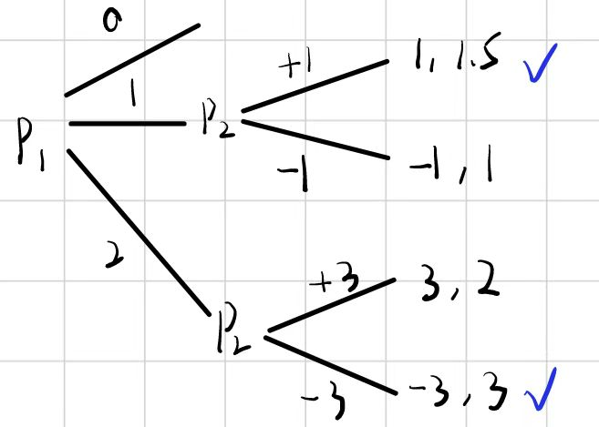

# Strictly Dominance
* $s_i$ strictly-dominate $s_i'$ if $s_i$ have a better payoff than $s_i'$ `whatever` $s_{-i}$ 
* `NOT` $s$ beats $s'$, but to consider **whatever** others.

`rational decisions may lead to bad outcomes`

## Ingredients of a Game
* Players $i,j,\ldots$
* One strategy $s_i$
* Strategy set $S_i, \forall s_i \in S_i$
* Strategy profile $s$: a particular play of the game  
* Utile for player $i$: $u_i = u_i(s_1,\ldots, s_n) = u_i(s)$
* $s_{-i}$ others' strategies
### prisoners' dilemma
what leads to prisoners' dilemma
* Failure of communication; communication has no trust
* Enforcements: Changing the payoffs

## Iteratively delete Dominated Strategies
Assuming others are rational so no one will choose dominated strategies.
## Rational
* I am rational
* Assume others are
* Assume others assume others' others are
* $\cdots$

## Best Response 
Given an assumption of what others are going to do ($s_{-i}$), then think about your strategy $s_i$.

## Nash Equilibrium
A strategy profile $(s_1^*,s_2^*,\ldots, s_n^*)$ is a Nash Equilibrium if $\forall i$, $s_i^* = \argmax\limits_{s_i^*} u(s_i^*,s_{-i}^*)$

Fixed $s_{-i}^*$, person $i$ has no incentive to deviate from $s_i^*$

# Models
Most are simplified, not sufficient accurate, and can be `wrong`
## Coordination Games
* Multiple Nash Equilibrium may occur: People's belief affects to which converge. 
* `Leadership` works because the better-off outcome is not dominated

## The battle of sexes
People preferring different Nash Equilibrium
* Making coordination may usually better than not (NE is locally best)
* Persuade to the NE I want

## Cournot Duopoly
*Dual monopoly* 
### Ingredients
- Player: 2 firms producing the identical product
- Strategies: Production quantity $q_i$
- Payoff: 
  - Production cost: $cq$, constant marginal cost $c$
  - Price: $p = a - b(q_1+q_2)$
  - Profit: $u_1(q_1,q_2) = q_1p_1-cq_1$
### Conclusion: 
  - price: complete < NE < monopoly
  - profit: complete < NE < monopoly

## Bertrand Competition
Compete on ~~quantity~~ prices
### Ingredients
- Playrer: 2 firms, identical product
- Strategies: Prices $p_i$, $S:=\{0<p<1\}$
- Payoff:
  -  Constant marginal cost $c$
  -  Quantity:  Total quantity that market demands $Q(p) := 1-min(p)$
  $$q_1 = \left\{\begin{array}{lc}
  1-p_1 & p_1 < p_2\\
  (1-p_1)/2 & p_1 = p_2\\
  0 & p_1 > p_2
  \end{array}\right.$$
  - $u_1 = q_1(p_1 -c)$
### Conclusion:
  - $$BR_1(p_2)=\left\{
    \begin{array}{lc}
    p_1 > p_2 & p_2<c\\
    p_2-\epsilon & c<p_2 \leq p^{monopoly}\\
    p^{monopoly} & p_2 > p^{monopoly}\\
    p_1 \geq c & p_2 = c
    \end{array}
    \right.
    $$
  - NE: $p_1 = p_2 =c$, no profit
  - Even only two firms, we are having a same result as complete competition! **We don't believe this**
  - **Different model (strategy set) on the same problem have very different result**
  
## Differentiated Product - Linear City
## Candidate - Voter Model
* #candidate is not fixed
* Candidate cannot choose position
* Voter votes for the closest candidate
* Each voter is a potential candidate 

Inspect: Voter runs a candidate or not

### Nash Equilibriums:
- Only one candidate in one position -> Middle runs, others not
- Multi-candidate -> Two similar candidates will **compete**, and both of them having **less** vote. 
  Entry can lead to distant candidate winning
- If two candidate are too extreme, someone on the center will run and win.

## Location Model
Two kinds of people $T$, $S$.

Payoff: 
* Exact 50%, 50% -> 1
* If not, people prefer their kind to be higher.

### NE:
- Exact 50%, 50% **Not Stable**
- 100%,0 and 0,100%. Segregated
- random

### Lesson:
- Seeing segregation **CANNOT** imply people prefer segregation 
  `Seeing a social phenomenon cannot conclude people prefer it` 
  `Individial choices add up to a phenomenons, but may not overlap well`
- Randomize the choices is a possible policy to fix it

# Mixed Strategies
Randomization over pure strategies
## Ingredient
### Notations
* One mixed strategy for person $i$ is $P_i$, where 
$P_i = \left(P_i(s_1), P_i(s_2), \ldots, P_i(s_n)\right)$. In addition we define $P_i(s_j) = P_i[j]$
* We are to consider the *expected utile* for person $i$:
$EU_i = EU_i(P_i, P_{-i}) = \sum_{s_j} P_i(s_j)U(s_j, P_{-i})$

### Property
* For a BR, all pure strategy with non-negative possibility have the same $EU$, and each of them is a BR
* Nash Equilibrium: 
  A mixed strategy $\bm P = (P_1^*, P_2^*,\ldots, P_N^*)$ is a NE if 
  $\forall i, P_i^* = \argmax EU_i(P_i,P_{-i})$
* all non-negative $s_i$ in $\bm P$ is  a BR.
* To find $P_i$, consider $P_{-i}$ and let each of its pure strategy have equal utile

## Lessons
- How to interpret $p$? 
  - genuine randomization, people's belief in the society, fraction in the big society 
- Nash Equilibrium for $i$ may **not** change if we only change $u_i$.
  - Only raising the fines for cheating cannot decrease compliance rate 

## Evolution & Game Theory
### Simplified Model
Identical individials, all playing the exact same strategy $s$. Suppose individials play games in pair, and the strategy with higher expected payoff thrives, the lower dies out.
### Evolutionary table
A strategy cooperate is evolutionary stable if for any mutation that is hardwired to play $s'$ dies out.
### Lesson
* If $(s, s)$ is not a NE, then $s$ is not evolutionary stable. Any evolutionary stable strategy is NE with itself.
* If $(s,s)$ is a strict NE, or a weak NE but $s$ always win, then $s$ is evolutionary stable
* Natural evolution can suck

## Huwk - Dove
|       |               H               |             D              |
| :---: | :---------------------------: | :------------------------: |
|   H   | $\frac{V-C}{2},\frac{V-C}{2}$ |           $V,0$            |
|   D   |             $0,V$             | $\frac{V}{2}, \frac{V}{2}$ |

### Analysis
* $D$ is dominated, $D$ can never be stable
* $(H,H)$ is pure NE if $V>C$
* If $C> V$, result in mixed strategy $\bm P = (\frac{V}{C}, 1-\frac{V}{C})$

### Lessons
- As long as $V \geq C$, *hawk* is evolutionary stable
- For $V< C$, if $V$ goes up, $H$ goes up, conversely, $H$ goes down.
- Payoff: $(1-\frac{V}{C})\frac{V}{C}$. Payoff goes **up** as $c$ goes up. `Cost to be aggressive helps the species`

# Sequential Move Game
The later players make decision based on the former players' strategy and the former players are also awared to this.

## Tree

## Backward Induction
$P_1$ look ahead in the tree and estimate $P_2$'s behavior, then go back to decide.

## Examples
### Moral Hazard
i.e. One buy a full insurance for his car, then he is likely to be less carefull  on his car because it's fully insuranced.

### Incentive Design
Carefully design the payoffs such that people are encouraged to do good things.

i.e. piece rates, share-cropping 
 Collateral

## Commitment Strategy
### Norman vs. Saxes

`Getting rid of some choices makes things better`

- because doing so changes the behavior of others.
- Let others **believe** you are aggressive.
- **Making decision first can be benefitial** 
- Ensure that others know your position.

## Stackelberg Model
Revisit Cournot Model under the concept of Sequential Model

What happens if firm1 and firm2 make decision sequentially? 

*backward induction*: $q_2 = \argmax profit(q_1,q_2)$

### Result
firm1 produce more, firm2 produce less, and total quatity still goes up, price goes down. 
firm1 earns more, firm2 earns less

Situation: $A$ assign a spy in $B$, $B$ know there's a spy. Then $B$ can make decision as if it's moving first.(If $A$ believes it)

`Use information to lead others do something benefitial for you`

*'First mover advangtage'* is not always true.

`Information can hurt you, but in other circumstances it's your advantage`

## Zermelo Theorem
* 2 players
* Perfect Information: *player  know everything happened prior* 
  Consider the nodes of the game, each term the player who is to move knows which node she is at.
* Finite number of nodes
* (Reduced version of theorem) 3 possible outcomes. win, loss, tie

### Examples
* Nim: If two piles have unequal stones, p1 force a win. Otherwise p2 force a win
* Tic-tac-toe: 1 can always force a tie
* Checkers.
* Chess.
  
`They have a solution!`
### Result
Either player 1 can force a win, or 1 can at least force a tie, or 2 can force a loss on 1.

### Prove: Induction
Induction on the maximum length of the game. $N$

Base Step: $N=1$.
 
Inductive Step:  
Supoose the above proposition is true for any $k\leq N -1$

* Each subgame is of $length < N$
* By hypothesis we know all subgame have solution $W_1,W_2,\ldots$
* Then the game of length $N$ has solution.

## Pure Strategy in Sequential Games
Pure strategy for player $i$ in a game of perfect information is a complete plan of action. It specifies which action $i$ will take at each $i$'s node.

### Subtle Point
Strategy specify every node regardless whether the node can be reached or not.*Even if the two nodes are exclusive*.

Because when we are doing backward induction, we need to check all the nodes to determine our movement at root. (Thus the exclusive branches are needed)

### Example 

|       |   L   |    R    |
| :---: | :---: | :-----: |
| (U,u) | (2,4) |  (0,2)  |
| (U,d) | (3,1) |  (0,2)  |
| (D,u) | (1,0) | `(1,0)` |
| (D,d) | (1,0) | `(1,0)` |

$[(D,u), R)$ is silly at $3$, because actually $3$ doesn't matter as $1$ chooses $D$. DO NOT just mechanically find the NE.

### Example
At the beginning there's a market with one monopolist. Now we have some entrants $firm_1, firm_2, \ldots$ who try to invade the market. 
Suppose the entrants will decide enter or not one by one sequentially, and each time the monopolist can fight the entrant with some negative cost or remain a (lower) positive profit.

What should the monopolist do?

Idea: Monopolist should fight when the first firm enter. Then he will efficiently convince the later firms they will be fought.

Problem: By backward induction, the monopolist will not fight the last one. Knowing this, iteratively he shouldn't fight any one.

Fix (New Idea): Suppose the monopolist have a probability $\epsilon$ to be insane. Then by fighting the first firms he can convince everyone he is insane.

`Behave irrational to convince you I'm not rational and build such a reputation. Even I'm rantional I will behave irrational`

## Duels
### Notations
* $P_i(d)$ is player $i$'s probability of hitting if $i$ shoot at distance $d$.
* $P_i(d)$ should be decreasing, $P_i(0) =1$, $P_i\neq P_j$
* $P_i$ is known by $j, j\neq i$

### Analysis
* *FACT* If 1 knows 2 isn't going to shoot, then 1 does't shoot either.
* *FACT* If 1 knows 2 will shoot, then 1 compare $P_1(hit)|_{this\ turn} = P_1(d)$ and $P_2(miss)|_{next\ turn}=1-P_2(d-1)$. 1 will shoot if 
$P_1(d) \geq 1- P_2(d-1)$
* Since both $P_1, P_2$ are decreasing, as $d$ goes down, there is the first distance $d^*$ such that $P_i(d)+ P_j(d-1) \geq 1$.
* $d^*$ is the point where first shot taken 
    - Dominance: No shot before $d^*$
    - Backward Induction: At $d^*$, player wants to know what will happen next. So inductively we examine $d=d^*-1, \ldots, 0$. At $d=0$, player shoot, so does $d=1$, ... , $d = d^*$.

## Ultimatums and Bargaining
### One-shot Game
* Two players
* Player 1 is going to make a 'take it or leave it' offer to player 2. 
The offer concerns $s,1-s$.
* Player 2 can accept the offer and get $s,1-s$. Otherwise he reject and both get $0,0$.
#### Analysis
Player 2 should accept whatever offered.  
BUT usually they don't if the offer is unfair! -> Player 1 should offer exactly the 'fair' share.

### 2-period Bargaining
* Two players, offer $s_1,1-s_1$
* Stage 1: Player 1 offers, player 2 accept or reject
* Stage 2: If player 2 rejects, he can give another offer $s_2, \delta -s_2$ to player 1
* Discount: For stage 2, the total offer only remains $\delta$

Player 1 wants player 2 to accept. Otherwise it will reduce to a one shot game with player 2 being the offerer, from which player 1 gets nothing. We call the last subgame an *ultimatum game*

|                 |       offerer        |         receiver          |
| :-------------: | :------------------: | :-----------------------: |
|    one shot     |          1           |             0             |
|    2-stages     |      $1-\delta$      |         $\delta$          |
|    3-stages     | $1-\delta+\delta^2$  |     $\delta-\delta^2$     |
| $\infty$-stages | $\frac{1}{1+\delta}$ | $\frac{\delta}{1+\delta}$ |

### Conclusion
* If $\delta \rightarrow 1$, equal share at $\infty$. 
(bargain forever, bargain at rapid successesion, same discount factor $\delta$)
* BUT, the very first offer should be accepted
* In real world, we dont know how the opposite values the pie, nor
we know about their patience.

`Dont be hurry when bargaining`

# Mixed Games
## Notations
### Information Set
An information set of player $i$ is a collection of player $i$'s nodes among which $i$ cannot distinguish.
### Tree

### Rules
Some bad tree architecture and information set may allow the player figure out where he is. (Left: different #node, Right: distinguishable by 1st choice)

* Indentical branches for player $i$
* Perfect Recall: Players remember everything they did before. (For institution, this means each departments knows what the others are doing)
* Perfect Information: All information sets contain exact one node.
* Inperfect Information:  Not perfect information 

### Analysis
Player 2 dont know what player 1 is doing, so he has to consider a simultaneous game. Also when player 1 does backward induction,  he have to put himself in player 2's shoe and to consider the simultaneous game 
So the information set part is equivalent to **Simultaneous Game**

In a sequential game, player 2 is actually making different choices at different nodes. But in the same information set, player 2 is making the same decision for all branches.
### Example: Prisoners' Dilemma
The following tree is a prisoners' dilemma.

Which can be converted to a table
|   |  L  |  R  |
|:-:|:---:|:---:|
| U | 2,2 | -1,3|
| D | 3,-1| 0,0 |

### (Pure) Strategy
A pure strategy for player $i$ is a complete plan of action, which specifies what player $i$ will do at each of $i$'s information sets.

### Example

|     |  L  |  R  |
|:---:|:---:|:---:|
| U,u | `4,2` | 0,0 |
| U,d | 4,2 | 1,4 |
| D,u | 0,0 | `2,4` |
| D,d | 0,0 | `2,4` |

However, the NEs with $u$ do not make sense! We know 1 never plays $u$.

## Definition (Refined)
### Subgame
A subgame is a part of a game within the tree that looks like a game
* It starts from a single node $n$. 
* It compresses all successors to $n$.
* It does not break up any information sets.

### Nash Equilibrium
A Nash Equilibrium is $(s_1^*, s_2^*,\ldots, s_n^*)$ is a subgame perfect equilibrium if it induces a Nash Equilibrium in every subgame of a game.
* For simultaneously games and sequential games respectly, SPE coincide with our early result. (For sequential games, the most backward games' SPE coincide with backward induction)
* Also works on Mixed Strategies

## Example: Strategic Investment
2 firms initially plays Cournot Competition
* $p = 2 - \frac{1}{3}(q_1+q_2)$, $c = 1$
* Cournot quantity $q^* = \frac{a-c}{3b} = 1$, $p = 4/3$, $profit = 1/3$

Now firm A has to choose whether to rent a *new machine*:
- The machine only works for A
- It cost $0.7$ in rental.
- It will lower A's cost to $0.5$.

### Analysis:
- Primary school answer is wrong! Because A's quantity will change.
- Equilibrium changes

If we simply assume the quantity balance remains unchanged, or if we ignore $q_b$'s change, we will wrongly draw a conclusion that the machine is not worthwhle.

But actually, at the new Nash Equilibrium, renting the machine can make more profit.

`Strategic Effects`: Once something is changed in a game, **people's behavior will change**. It's unwise to follow the past behavior to predict future impact.

## War of Attrition
* 2 players. Each period they simultaneously choose *fight* or *quit*.
* Game ends as soon as someone quit.
* If the other player quit first, you win a prize $v$.
* Each period in which both players *fight*, each player pays $-c$
* If both quit, both gain $0$

### Analysis
There are situations in which one of the players or both of them quit at the beginning. But it is also likely both of them choose to fight for long. And once they start fighting, all the cost is sunk, so there's little tendency to stop.

### Analysis: Two Period Game

1. Subgame at A (period 2).
   | $-c$ |$f(2)$|$q(2)$|
   |:----:|:----:|:----:|
   |$F(2)$|$-c,-c$|$v,0$|
   |$Q(2)$|$0, v$|$0,0$|
   
   Nash Equilibrium: $(F,q)$, $(Q,f)$
2. Roll back to stage one. Replace the A at period 2 with the above NEs (*continuation payoffs*).
3. For stage 1, consider respectively which is the equilibrium they  end up converge at.
   |NE:$(F,q)$|  $f(1)$ |$q(1)$|
   |:--------:|:-------:|:----:|
   |  $F(1)$  |$v-c,-c$ | $v,0$|
   |  $Q(1)$  |  $0,v$  | $0,0$|
   
   |NE:$(Q,f)$|  $f(1)$ |$q(1)$|
   |:--------:|:-------:|:----:|
   |  $F(1)$  |$-c,v-c$ | $v,0$|
   |  $Q(1)$  |  $0,v$  | $0,0$|
   
   $v>c$, player 1 has a dominant strategy in the case $(F,q)$, player 2 has a dominant strategy in the case $(Q,f)$. The two situatins have NE $(F,q), (Q,f)$ at stage 1 respectively.
   
   No actual fights occur. 'I know I win tomorrow'.  
4. Mixed Strategies.
   - Stage 2: 
   $P(F/f) = \frac{V}{V+C}$, $P(Q/q) = \frac{C}{V+C}, payoff = 0$
   
   - Stage 1:
     | Mixed| $f(1)$ |$q(1)$|
     |:----:|:------:|:----:|
     |$F(1)$| $-c,-c$| $v,0$|
     |$Q(1)$|  $0,v$ | $0,0$|

     which is the same matrix as stage 2.
5. Mixed strategy result: $(P^*,P^*)$. payoff $0$.
### Analysis: $\infty$-Period Game
Idea: Self-repeating architecture. Assume a subgame has a general mixed strategy $p,1-p$, solve it out by adding back the sunk cost and continuation payoff.

Result: still $(P^*,P^*,\ldots)$

# Repeated Interation
In on going reltionships, the promise of future rewards and the threat of future punishment may sometimes provide incentives for good behavior today

Sometimes a finite 'future' can generate such incentive, but there are also times that this isn't going to work if the relationship will end one day.

If a stage game has more than one NE in it, then we may be able to use the prospect of playing different equilibria tomorrow to provide incentives (reward or punishment) for cooperation today.

For an ongoing relationship, to provide incentives for good behavior today, it helps for there to be a high probability that the relationship will continue

## Prisoners' Dilemma
Can we sustain cooperation in prisoners' dilemma?

|           | cooperation | defect |
|:---------:|:-----------:|:------:|
|cooperation|     2,2     |  -1,3  |
|   defect  |     3,-1    |   0,0  |

### Analysis
Suppose the game is played for $n$ times. 
- We know at the $n$th time *defect* is dominant, so people choose *defect* at $n$th time.
- At $n-1$th round, since we know we're defecting later, there's no use cooperating, so $defect$ at $n-1$
- Unraveling from the back, people *defect* all along the way.

So future doesn't help here, because one day it will comes to an end

### Similar Situations: The Upcoming End of a Relation Discourage Cooperation
* `Lame Duck Effect`
* retirements, friendship

## Counterexample: Finite Relationship brings Incentive
The following game will be played twice.
|   |  A  |  B  |  C  |
|:-:|:---:|:---:|:---:|
| A | 4,4 | 0,5 | 0,0 |
| B | 5,0 | 1,1 | 0,0 |
| C | 0,0 | 0,0 | 3,3 |

We'd like to sustain (A,A).

* One shot game: (A,A) can't be NE,  (B,B), (C,C) are NE.
* Twice:  
  By the same argument we can actually argue (A,A) isn't going to be played.

  But, here is a magic stratgy: 
  > play A in round 1. In round 2, if (A,A) played in round 1 then play C, otherwsie play B.

  Check:
  * Check SPE
  *  The temptation to defect today is smaller than the value of the reward - the value of the punishment. 

### Lesson
If a stage game has more than one NE in it, then we may be able to use the prospect of playing different equilibria tomorrow to provide incentives (reward or punishment) for cooperation today.

* You know he would cooperate if you cooperate. But in prisoners' dilemma he will certainly defect tomorrow because strictly dominance
* Subgame Perfect Equilibrium can ensure NE in last game. :)

## Infinite Stages: Prisoners' Dilemma
* Each round play prisoners' dilemma.
* Each time the game has a probability of $\delta = 0.75$ to continue.
  
> Strategy: Cooperate if no one defected before, otherwise defect.

### Check for SPE
$$Temptation\ to\ cheat\leq Value\ of\ cooperating - Penalty\ for\ cheat$$
* If one day one of the player defect: $3-2\leq \delta(2\frac{1}{1-\\delta} -0)$. True for $\delta \geq 1/3$
* Why I have to follow your strategy!  
  CCC D C DDDDD : dominated 

### Lesson
For an ongoing relationship, to provide incentives for good behavior today, it helps for there to be a high probability that the relationship will continue

## One-period Punishment
> Play c to start, then play c if either (c,c) or (d,d) were played. Otherwise play d.

### Check for SPE
$3-2 \leq \delta(2\frac{1}{1-\delta} - 2\frac{\delta}{1-\delta})$. True for $\delta \geq 0.5$

### Lesson
Trade off: If you use a less draconian penalty, then you need more weight on the future. (Easier to cheat vs. more thrill in future)

`So foreign investors may pay more in case you run off, but this may decay as you cooperate repeatly`

# Asymmetric Information - Signaling
## Verifiable Information
eg. Cournot
* Firm A, B competing in quantities
* Firm B has cost $c^m$.
* Firm A has cost 
  $\left\{\begin{array}{l}
  c^h  = c^m +x\\
  c^m\\
  c^l = c^m - x
  \end{array}\right.$
* Initially firm B knows only his own cost, while firm A knows both.
* Firm A can costlessly and verifiably **reveal** its cost to B

### Reveal or Not ?
Strategy: Reveal if A's cost is lower.

Problm: If A dont reveal, B know A is middle or higher. Then A should reveal at middle.

Then unreveal implies A has high cost 

## Informational Unraveling
The lack of signaling can be imformative
* Verifiable
* Receiving side need to know the information

## Not Verifiable Information
Less persuasive
* Would you like to work for us? --> Yes! But everybody knows it's useless

### Costly Signaling Model
* Two kinds of workers in society.
  * Good workers *G* with productivity $50$. $10\%$
  * Gad worders *B* with productivity $30$. $90\%$  
* Firm compete for workders. 
  
  Firms pay $50$ to workers they identify as good, $30$ to workders they identify as bad, $32$ if they cannot identify.

Good students want to distinguish themselves from the others --> education.

Suppose the cost to get the desired degree (i.e. MBA) is $5$ for $G$, but $10+\epsilon$

Equilibrium: It takes 3 years to get the degree. All the good has the degreee, all the bad does not, firms use the degree to distinguish workers.

`A good signal needs to be differentially costly across types -> self-select`

`If we get gid the cost difference -> qualification inflation`

# Auctions
Games that you dont know your opponents' payoff.

|      Common Value      |      Private Value     |
|:-----------------------|-----------------------:| 
| Value of the good for sale is the same for all | The value of the good in hand is different for each person and irrelevant to others.|
| $[V]$ | $[V_i]$ |

## The Winners' Curse
In common value auctions, it's common that the winner bid is higher than the true value

## Common Value Auction
- Payoff: $V - bid$ for winner, $0$ otherwise.
- People estimate the true value $V$. Suppose the $i$th person have estimation $Y_i = V + \epsilon_i$, where $\epsilon_i \sim N(0,\sigma^2)$.
- Suppose people bid $B_i \approx Y_i$

Obviouly the person with bias $+\epsilon$ wins, resulting in the biggest error.

- US auction out the right to drill in gulf
- Baseball free agent
- `IPO` Initial Public Offering

So if you dont want to end up regretting, suppose you win and fall into the winners' curse, the only thing you should do is to bid significantly less. Then you may not win, but when you do win you wont regret.

### Different Auctions.
1. First-price, sealed bid auction
2. Second-price, sealed bid auction
3. Ascending open auction
4. Descending open auction

Auction 4 is basicly the same as 1, but more exciting. Auction 2,3 have some similarity, because when the second last hand went down, things are determined.

## Private Value Auction
value $v_i$, bid $b_i$.

### Second-price, sealed
payoff $v_i - \bar{b_j}$ if win, $0$ otherwise. $\bar{b_j} = \max_{j\neq i} b_j$

*Bid your value*: Set $b_i = v_i$ is weakly dominating strategy.

### First-price, sealed
payoff $v_i - b_i$ if win, $0$ otherwise

Set $b_i < v_i$. In this way you have a chance to win.

A classic tradeoff between marginal cost and marginal benefit

## Raising Money in Auctions
### Theorem
Provided a private value auction environment, all types of auctions that have the property *in equilibrium the person with the highest value ends up earning the good* yields exactly the same revenue (in expectation).