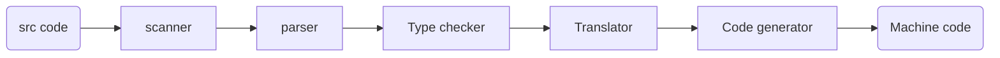

```
Program Languages
-- Theory
---- Language desian
---- Type system
---- Semantics and logic

-- Environment
---- Compiler
---- Runtime

-- Application
---- Program analysis
---- Program verification
---- Program synthesis
```
A perfect static analysis tool should be
- Sound(Overapproximation) - Assure no FN
- Complete(Underapproximation) - Assure no FP

Most static analysis tools are sound but not complete.
- Otherwise may occur wrong conclusion, further optimization cannot be done.

> example: `x = input ? 1 : 0`
> - sound: x= 0,1,2,3,4,5,6,7,8,9
> - complete: x= 0,1

ensure (or get close to) soundness, while balancing *precision* and *speed*

#### Rice's Theorem

Any `non-trivial` property of the behavior of programs in a `r.e.` language is *undecidable*.
> `r.e.` language: recursively enumerable language = recongnizable by a Turing machine    

A property is trivial if either it is not satisfied by any r.e. language, or if it is satisfied by all r.e. languages. Otherwise, it is non-trivial.

> non-trivial properties
> ~= interesting properties
> ~= the properties related to runtime behavior

### Two Words conclude static analysis
- Abstraction
- Over-approximation

#### Over-apprx: Transfer Function
`transfer function` defines how to evaluate different program statements on abstract values.

```
x = 10 = +, y = -1 = -;
x + y = T
a[x + y] = ⊥ // over-approx
```

#### Over-apprx: Control Flows
Due to path explosion, `flow merging` is taken for granted in most static analysis tools. (不会跟着 branch 进去)

Over-approx: transfer function + control flow?

# Lesson 2: Intermidiate Representation
### Compiler vs Static Analysis

- scanner: lexical analysis（词法分析）
  - regexp
  - src code -> token stream
- parser: syntax analysis（语法分析）
  - Context-free grammar
  - token stream -> AST
  - Detect 'Like your hair I'
- type checker: semantic analysis（语义分析）
  - Attribute grammar
  - AST -> decorated AST
  - Detect 'Apple eats me'
- Translator: IR generation
  - AST -> IR
- Code generator: IR optimization
  - aka. a part of Static Analysis

#### AST vs. IR
IR is language independent, low level and close to machine code, compact and uniform, contains control flow information. Thus usually considered as the basis for static analysis

### IR
#### 3-Address Code
- At most one operator on the right
- Address can be a name, a const, or compiler-generated temporary 

bop(binary operation), uop(unary op.), rop(relational op.)

#### Jimple for Java
```jimple
r0 := @parameter0: java.lang.String // := is a common operator in formal language, here it means assignment for parameter0
r1 := virtualinvoke r0.<java.lang.String: int length()>() // virtualinvoke is a method call
```
#### JVM Invoke Instructions
- invokespecial: call constructor, superclass method, private method
- invokevirtual: instance method(virtual dispatch)
- invokeinterface: cannot optimize, check interface implementation at runtime
- invokestatic: static method
- invokedynamic: Java 7+, dynamic language runs on JVM
  
#### Method Signature

    <class name: return type, (optional) method name(parameter types)>

*Something alike the declarator in C++:* 
  
    attr (optional) decl-specifier-seq (optional) declarator virt-specifier-seq (optional) function-body

#### Class Definition
- default constructor: `<init>` call super class constructor
- static initializer: `<clinit>` static field initialization, class load initialization. This function is called after a class is first loaded from disk

## SSA (Optional)

## Control Flow Graph
### Basic Block
`Basic block` is the maximal sequence of consecutive 3-address instructions that
- Enter only at the beginning
- Exit only at the end

There is an edge from block A to block B if and only if
- There is a conditional or unconditional jump from the end
of A to the beginning of B
- B immediately follows A in the original order of instructions and A does not end in an unconditional jump

*A, B are Predecessor and Successor*

#### Entry and Exit
Usually add two nodes, `entry` and `exit`
- entry has many successors(i.e. concurrent)
- exit has many predecessors
